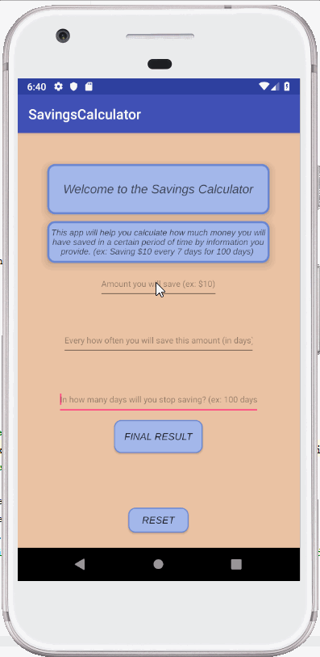

## SavingsCalculator

### App Description
This app calculates how much money will be saved after a period of time using the following input:
* How much money will be saved periodically
* Every how often the amount will be saved
* How long the saving period lasts

# Example
* $20
* 7 Days
* 365 Days
# Result:
* $1040 will be saved

### App Walk-through

 

